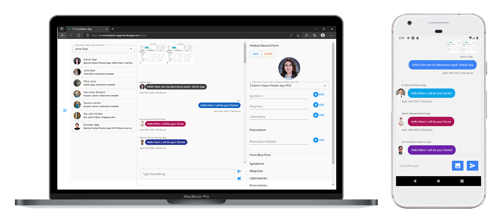

### E-Consultation-App - Medical Services Management App

### Description
E-Consultation-App is Medical Services Management System that enables University of Rizal System employees and students to consult to the University's Physician at any given time, to recommend the right treatment, medication and make prescriptions. You can use doctor@gmail.com and **12345678** as email and password to test the physician account. For Students you can use the android app [download here](https://drive.google.com/drive/folders/1ie0HsVjOIcQoWEhIW3Unc7eTSXp6y5hZ) and johndoe@gmail.com and **12345678** as credentials.
### Specification
1. RESTful API
2. S3 Bucket
3. Document & Image Processing
4. Real-Time Consultation System
5. Verifiable & Downloadable Prescription & Medical Records by Doctor
### Installation
1. Before following this steps, environment variables must be define in **config.env**
   
2. Copy Files
```sh 
git clone https://github.com/user109436/Medical-Services-Management-App.git
```
1. Open Directory in VS Code or Any Text Editor
2. Install Packages in main directory (Server Level)
```sh
npm install
```
4. Run Database Seeds or Dummy Data 
```sh
cd utils
node database
```
5. Install Packages in client folder (Client Level)
```sh
cd client
npm install
```
6. Run project on developement (will run server and client)
```sh
npm run develop
```
6. Run Server Only (Optional)
```sh
npm run server
```
6. Run Client Only (Optional)
```sh
cd client
npm start
```